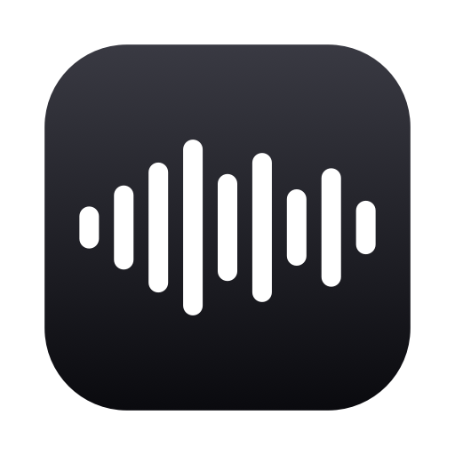

<p align="center">
  
</p>

<h1 align="center">hearsay</h1>

<p align="center"><b>Hold fn+shift. Speak. Release.</b><br>
The words land where your cursor was — and the audio never left your Mac.</p>

<p align="center">
  <a href="https://github.com/note89/hearsay/releases"></a>
  
  
  <a href="LICENSE"></a>
</p>

---

Push-to-talk dictation for macOS, built to beat the cloud subscription apps at their own game:

- **On-device by default** — Apple's SpeechAnalyzer (Neural Engine) for speech, Apple's on-device LLM for cleanup. No account, no subscription, no network. $0.
- **Cleanup that writes what you meant** — punctuation, fillers gone, self-corrections applied, dense phrasing, dash lists, per-app tone (chat/email/code/Markdown). Three levels: Off / Light / Full.
- **A built-in bake-off lab** — run Wispr Flow (or any rival) side by side on identical audio and get word-error-rate + latency scoreboards, measured honestly.

## Install

**Download**: grab `hearsay-x.y.z.zip` from [Releases](https://github.com/note89/hearsay/releases), unzip, drag `hearsay.app` to `/Applications`.

> The app is signed with a local certificate, not a paid Apple Developer ID — macOS will refuse the first
> launch. Either **right-click → Open → Open**, or:
> ```sh
> xattr -dr com.apple.quarantine /Applications/hearsay.app
> ```

**Or build from source** (Command Line Tools 26+ is enough — no Xcode):

```sh
softwareupdate -i "Command Line Tools for Xcode 26.6-26.6"   # once, if you don't have CLT 26+
git clone https://github.com/note89/hearsay && cd hearsay
scripts/bundle.sh && open build/hearsay.app
```

Building repeatedly? Run `scripts/fix-permissions.sh` once — it creates a stable local signing
certificate so macOS permission grants survive rebuilds.

### Linux & Windows

`hearsay-rs` is the same product on the other two desktops: one Rust core, an egui window, whisper.cpp
on-device. It reads and writes the same files as the Mac app (history, dictionary, bake-off runs,
`keys.env`), so the data folder moves with you.

```sh
# Debian/Ubuntu build deps (Rust 1.85+)
sudo apt install cmake clang libclang-dev pkg-config libasound2-dev libx11-dev libxi-dev \
  libxtst-dev libxdo-dev libxkbcommon-dev libwayland-dev libgl1-mesa-dev
# Windows: Visual Studio Build Tools (C++ workload) + cmake
git clone https://github.com/note89/hearsay && cd hearsay/crossplatform
cargo run --release -p hearsay-rs
```

First launch: Dictation → **Download model** (`ggml-base.en`, 148 MB, once). Then hold **Ctrl+Alt+Space**
anywhere, speak, release. `hearsay-rs transcribe file.wav` runs the engine on a file.

What is different from the Mac app, on purpose (the reasoning is in `PLAN-CROSSPLATFORM.md`):

- Whisper is batch: text appears at key-up, no live partials in the pill.
- Insertion is paste: it lands where the caret is, and hearsay cannot verify it. No frontmost window → clipboard.
- No field context, no per-app tone, no secure-field detection — a dictated password would land in History, so pause History first.
- Cleanup (Light / Full) is cloud opt-in through OpenRouter until a local model ships. Off is entirely on-device.
- Linux global hotkeys need X11 (or XWayland); pure Wayland compositors do not expose one.

Data folder: Linux `~/.local/share/hearsay`, Windows `%APPDATA%\hearsay\data`. Keys: `keys.env` in that
folder (`NAME=value` lines) or environment variables.

## First run — three permissions

macOS asks once: **Microphone** (the prompt), then enable *hearsay* under **Accessibility** and
**Input Monitoring** (System Settings → Privacy & Security). Then menu bar → Relaunch. The menu
shows a "⚠ Fix permissions…" row until everything is granted.

If your fn key is bound to "Change Input Source" or emoji, that's fine — the hotkey is the
**fn+shift chord**, which doesn't collide.

## Using it

Put the cursor anywhere you can type. **Hold fn+shift, talk, release.** A small pill shows live
transcription; on release the cleaned text lands at your cursor. Everything else lives in the
menu bar → **Open hearsay…** window:

| Pane | What's there |
|---|---|
| **Dictation** | engine cards, language (only when the engine needs one), field context toggle, permissions |
| **Dictionary** | your terms (`mprocs`) and rewrites (`mprox → mprocs`) — a plain text file underneath |
| **Style** | cleanup level with example outputs; the app→tone table |
| **Bake-off** | the comparison lab — see below |
| **History** | every dictation that didn't land, recoverable; per-record delete, clear, off-switch |

## Engines

| Engine | Runs | Cost | Language |
|---|---|---|---|
| **Apple on-device** (default) | this Mac, offline | $0 | picked by you (no auto-detect) |
| ElevenLabs Scribe v2 | ElevenLabs cloud | ~$2.45 / 100k words | automatic, mid-sentence mixing |

Mixing languages mid-sentence (svengelska) works with Scribe v2 and the Gemini engines. Apple's on-device
model is locked to one locale per dictation, so it can only do one language at a time.
| Gemini 2.5 Flash‑Lite / Flash | Google via OpenRouter | ~$0.50 – $1.85 / 100k words | automatic |

Cloud engines are optional comparison tools: Open hearsay… → **Dictation** → **API Keys…** opens
`~/Library/Application Support/hearsay/keys.env` (0600, template included). `OPENROUTER_API_KEY`
unlocks both Geminis; `ELEVEN_LABS_API_KEY` unlocks Scribe. ElevenLabs is not reachable via
OpenRouter — separate key.

## Privacy, precisely

- Apple engine: audio, transcript, field context — nothing leaves the Mac.
- The cleanup model **always** runs on-device, so field context and dictionary terms are never
  uploaded even when a cloud transcription engine is selected.
- Secure (password) fields: dictation is blocked before the microphone even starts.
- The system log gets timings and outcomes, never content. History is 0600, cappable, clearable,
  optional. Clipboard writes are marked transient so clipboard managers skip them.
- Cloud engines upload exactly one thing: the utterance WAV, to the provider you picked.

## The bake-off

Open hearsay… → **Bake-off**, run Wispr Flow alongside, and read the script sentences. Both apps
hear the same audio from the same key-up; hearsay never inserts while the pane is front — it watches
the pane's text box for the rival's output and scores both against the on-screen sentence:
word-level diffs, WER (numeral style, units, ordinals and contractions never count as errors),
latency on one clock, per-engine scoreboards. Each record stores the sentence it was a take of, so
retakes can't corrupt a run. `Reset run` archives to
`~/Library/Application Support/hearsay/bakeoff.jsonl` archives.

## Field context & dictionary

- **Field context** (default on): ~600 chars around your cursor go to the *on-device* cleanup model
  as terminology reference — the accuracy trick cloud apps upload your screen for, done locally.
- **Dictionary**: terms bias the cleanup toward exact spellings; `from -> to` rewrites apply
  deterministically even with cleanup off. Nothing is ever learned behind your back.

## Where the decisions live

- `Sources/Insertion/Inserter.swift` → `strategies(for:)` — insertion strategy order (`DECISION_INSERTION_POLICY`)
- `Sources/Polish/Polisher.swift` → `PolishGuard` — when cleanup "changed your meaning" and raw wins (`DECISION_POLISH_GUARD`)
- `Sources/hearsay/StyleInference.swift` — which apps get which tone
- `Sources/hearsay/Engine.swift` — one type owns every engine; a new engine is one new case

Design history: [PLAN.md](PLAN.md) (the original concept design and the bet that started this),
[DESIGN-REVIEW.md](DESIGN-REVIEW.md) (concept & data-structure reviews that shaped the refactors).
Scorer tests: `swift run bakeoff-tests`.

## License

GPLv3 — see [LICENSE](LICENSE). © 2026 Nils Eriksson.
