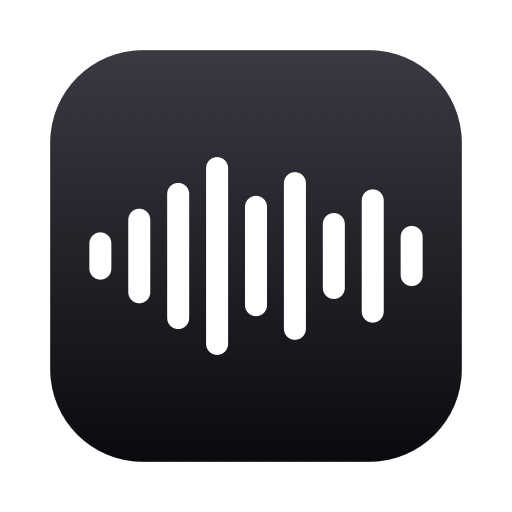
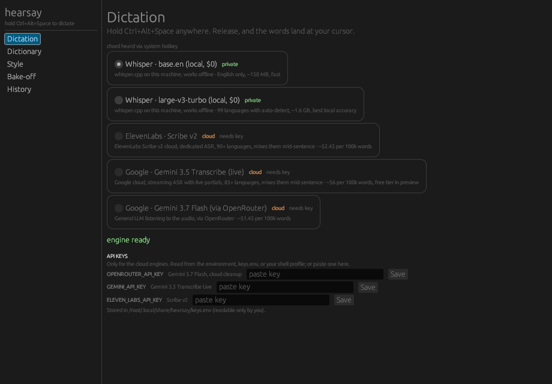
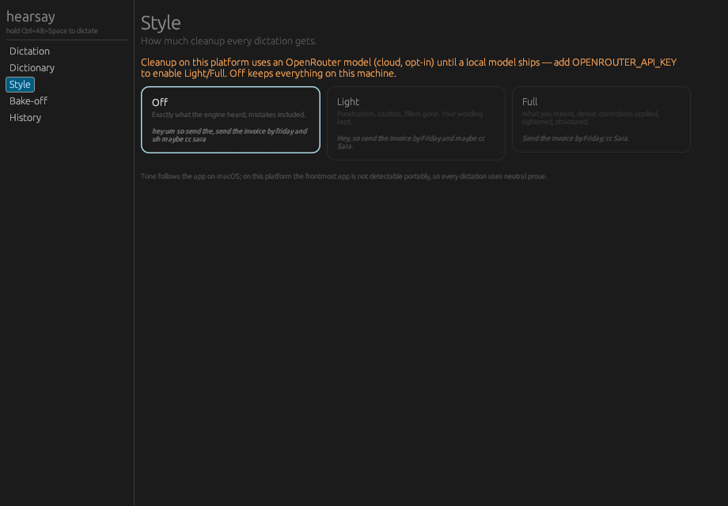
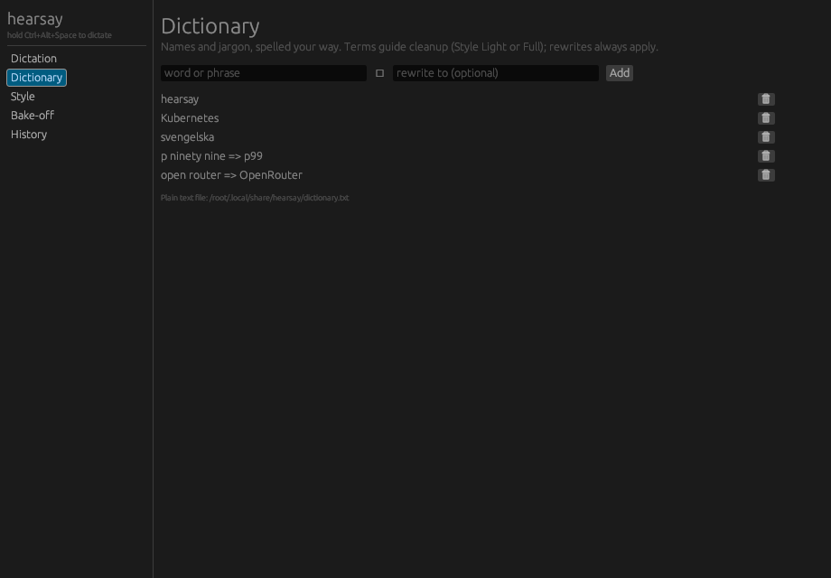
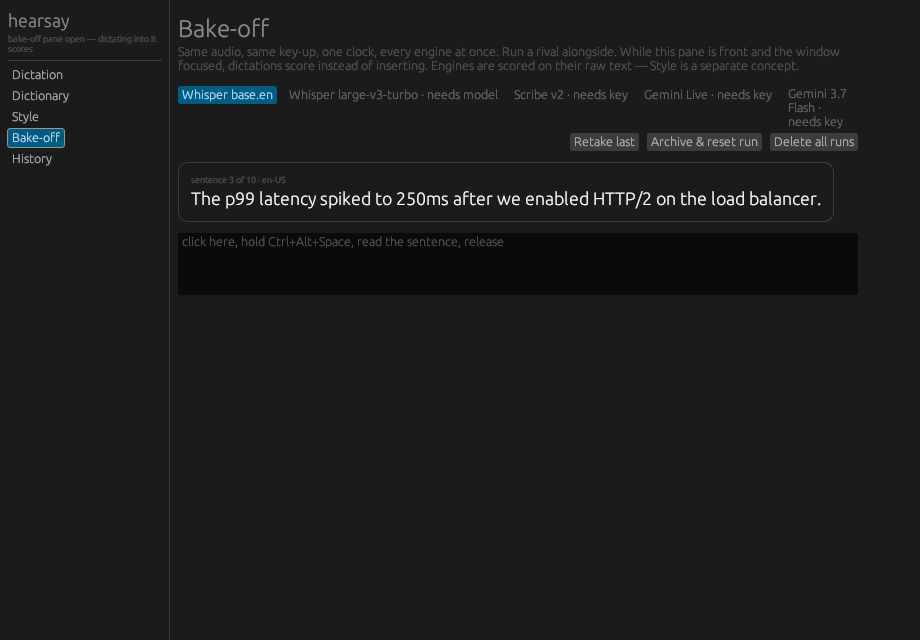

<p align="center">
  
</p>

<h1 align="center">hearsay</h1>

<p align="center"><b>Hold a key. Speak. Release.</b><br>
The words land where your cursor was — and the audio never left your machine.</p>

<p align="center">
  <a href="https://github.com/note89/hearsay/releases"></a>
  
  
  
  <a href="LICENSE"></a>
</p>

---

Push-to-talk dictation, built to beat the cloud subscription apps at their own game:

- **On-device by default.** macOS: Apple's SpeechAnalyzer and on-device LLM. Linux and Windows: whisper.cpp. No account, no subscription, no network. $0.
- **Cleanup that writes what you meant.** Punctuation, fillers gone, self-corrections applied, dense phrasing, lists, per-app tone. Off / Light / Full.
- **Mixed languages mid-sentence.** Svengelska works with the cloud engines.
- **A built-in bake-off lab.** Race every engine against Wispr Flow (or any rival) on identical audio, and get word-error-rate and latency scoreboards, measured honestly.

<p align="center">
  
</p>

## Get running

### macOS (Apple Silicon, 26 or newer)

Install with Homebrew:

```sh
brew install --cask note89/tap/hearsay
open /Applications/hearsay.app
```

Or download `hearsay-0.3.0.zip` from [Releases](https://github.com/note89/hearsay/releases), unzip, and drag `hearsay.app` to `/Applications`. The app is signed with an Apple Developer ID, notarized, and carries its notarization ticket for offline verification.

Menu bar → **Open hearsay…** → **General** shows the permission setup. Click **Enable** for **Microphone**, **Input Monitoring**, and **Accessibility**, granting each when macOS asks. Accessibility enables insertion; without it, finished text goes to the clipboard. Relaunch after granting Input Monitoring when macOS asks.

Put the cursor anywhere you can type. **Hold fn+shift, talk, release.** General options let you choose another modifier shortcut and position the floating bar. No Hearsay account is required.

Update a Homebrew install with `brew upgrade --cask note89/tap/hearsay`. About → **Check for updates** can check GitHub and open the latest release for a manual download.

If your fn key is bound to "Change Input Source" or emoji, that's fine: the hotkey is the fn+shift chord, which doesn't collide.

### Linux

1. Download `hearsay-rs-linux-x86_64.zip` from [Releases](https://github.com/note89/hearsay/releases), unzip, `chmod +x hearsay-rs`.
2. Install the runtime libraries. Each one is there for a reason:

   | Library (Debian name) | Why hearsay needs it |
   |---|---|
   | `libasound2t64` (`libasound2` before Ubuntu 24.04) | the microphone, through ALSA — PipeWire and PulseAudio both expose it |
   | `libx11-6` `libxext6` `libxtst6` `libxinerama1` | the window and the global hotkey on X11; XTest delivers the paste keystroke |
   | `libxdo3` | the paste keystroke itself (xdotool's library) |
   | `libxkbcommon0` | keyboard layouts for the window |
   | `libgl1` | the window is drawn with OpenGL (Mesa on most machines) |

   ```sh
   # Debian / Ubuntu
   sudo apt install libasound2t64 libx11-6 libxext6 libxtst6 libxinerama1 libxdo3 libxkbcommon0 libgl1
   # Fedora
   sudo dnf install alsa-lib libX11 libXext libXtst libXinerama xdotool libxkbcommon mesa-libGL
   # Arch
   sudo pacman -S alsa-lib libx11 libxext libxtst libxinerama xdotool libxkbcommon mesa
   ```
3. Know which session you are in: `echo $XDG_SESSION_TYPE`.

   | | X11 | Wayland (GNOME and KDE default) |
   |---|---|---|
   | Hotkey | registered with the X server | read from the keyboard devices — `sudo usermod -aG input $USER`, then log out and in |
   | Text | pasted at the caret | wlroots compositors (Hyprland, Sway): pasted at the caret · GNOME: copied, the pill says "press Ctrl+V" |

   Wayland has no global hotkey, that's the compositor's rule. Whether a paste can be injected is also the compositor's call: Hyprland, Sway and river accept virtual-keyboard input, so the text lands; GNOME refuses it, so the text goes to the clipboard. hearsay asks the compositor and reports honestly. The Dictation pane tells you which path it is on. `hearsay-rs insert "hello"` tests insertion by hand.
4. Run `./hearsay-rs`. Dictation → **Download model**. Then put the cursor anywhere, **hold Ctrl+Alt+Space, talk, release.**

### NixOS

The prebuilt binary does not start on NixOS (no `/lib64` loader, no libraries in standard paths). Build it
with the flake instead; it links the libraries and wraps the ones loaded at run time:

```sh
nix run github:note89/hearsay            # flakes enabled; first build compiles whisper.cpp, a few minutes
```

or in your configuration:

```nix
{
  inputs.hearsay.url = "github:note89/hearsay";
  # …
  environment.systemPackages = [ inputs.hearsay.packages.${pkgs.system}.hearsay-rs ];
  users.users.you.extraGroups = [ "input" ];   # Wayland: the hotkey reads the keyboard devices
}
```

On Hyprland, Sway and other wlroots compositors the paste lands in the focused window (they offer
virtual-keyboard input); on GNOME it goes to the clipboard, pill says "press Ctrl+V". `nix develop` gives
a shell with the toolchain and every build dependency. If you really want the release binary,
`nix-ld` or `steam-run ./hearsay-rs` will load it.

### Windows

1. Download `hearsay-rs-windows-x86_64.zip` from [Releases](https://github.com/note89/hearsay/releases), unzip, run `hearsay-rs.exe`. It is unsigned: SmartScreen → **More info → Run anyway**.
2. Dictation → **Download model**. Then **hold Ctrl+Alt+Space, talk, release.** The text is pasted at the caret.

### Which local model

The Download button offers two whisper.cpp models; the prebuilt binaries run them on the CPU.

- **base.en** (150 MB) — English only, about half a second per sentence on any recent CPU. Start here.
- **large-v3-turbo** (1.6 GB) — 99 languages with auto-detect, the best local accuracy. A few seconds per sentence on a good CPU. For a GPU, build from source with `--features cuda` (NVIDIA, needs the CUDA toolkit), `--features vulkan` (any Vulkan driver) or `--features metal` (Apple); these are whisper.cpp's own back ends, passed straight through, and we have not benchmarked them.

Local models are batch: text appears at key-up. If you want partials in the pill on Linux or Windows, Gemini 3.5 Transcribe (cloud) streams.

The release binaries are built with portable CPU flags (AVX2 baseline on x86-64, no `-march=native`), so they run on any machine from the last decade. A `cargo build` on your own machine tunes whisper.cpp to your CPU, which is a little faster.

<p align="center">
  
</p>

## Using it

Everything lives in one window (macOS: menu bar → **Open hearsay…**; Linux and Windows: the window is the app).

| Pane | What's there |
|---|---|
| **General** (macOS) | dictation shortcut, pause dictation, launch at login, floating bar preview and position reset |
| **Dictation** | engine cards, model download on Linux/Windows, language (only when the engine needs one), permissions |
| **Cloud providers** (macOS) | optional provider keys, secure Keychain storage, key source and removal; on Linux/Windows, keys live in Dictation |
| **Dictionary** | your terms (`mprocs`) and rewrites (`mprox => mprocs`) — a plain text file underneath |
| **Style** | cleanup level with example outputs, and which model does it: on this machine, or Gemini 3.7 Flash via OpenRouter for long, structured rewrites; on macOS the app→tone table |
| **Bake-off** | the comparison lab — see below |
| **History** | recent dictations, recoverable; per-record delete, clear, off-switch |
| **About** (macOS) | app version, manual update check, releases and Homebrew update instructions |

<p align="center">
   
</p>

## Engines

| Engine | Runs | Cost | Language |
|---|---|---|---|
| **Apple on-device** (macOS default) | this Mac, offline | $0 | picked by you, one at a time |
| **whisper.cpp** (Linux and Windows default) | this machine, offline | $0 | base.en: English · large-v3-turbo: 99 languages |
| ElevenLabs Scribe v2 | ElevenLabs cloud | ~$2.45 / 100k words | automatic, mid-sentence mixing |
| Gemini 3.5 Transcribe (live) | Google cloud, streaming | ~$6 / 100k words, free tier in preview | automatic, mid-sentence mixing |
| Gemini 3.7 Flash | general LLM via OpenRouter | ~$1.45 / 100k words | automatic |

Gemini 3.5 Transcribe is the one cloud engine that streams: audio goes up while you hold the key, partials show in the pill, and the final text is ready almost as you release. Your dictionary terms become its custom vocabulary, and with Style Light or Full it runs the model's own filler removal.

Which to pick: offline and English, base.en or Apple. Offline and Swedish, large-v3-turbo. You have an OpenRouter key, Gemini 3.7 Flash also unlocks cloud cleanup on Linux and Windows. You want the fastest cloud path, Gemini 3.5 Transcribe.

### API keys

Only the cloud engines need a key. On macOS, enter a key in **Cloud providers** and save it securely in the login Keychain. Keys are resolved from the Keychain, process environment, `keys.env`, then `~/.zshrc`. The pane shows where a key was found and lets you remove a saved key without displaying it. Removing a Keychain entry can reveal an existing environment or file key. On Linux and Windows, the Dictation pane saves keys to `keys.env`, readable only by you; keys are resolved from the process environment, that file, then supported shell profiles.

| Key | Unlocks | Where to get it |
|---|---|---|
| `OPENROUTER_API_KEY` | Gemini 3.7 Flash as an engine, and the cloud cleanup model on every platform | https://openrouter.ai/keys |
| `GEMINI_API_KEY` | Gemini 3.5 Transcribe Live | https://aistudio.google.com/apikey |
| `ELEVEN_LABS_API_KEY` | Scribe v2 (not reachable via OpenRouter) | https://elevenlabs.io |

Data folder: macOS `~/Library/Application Support/hearsay`, Linux `~/.local/share/hearsay`, Windows `%APPDATA%\hearsay\data`. History, dictionary and bake-off files share a format across platforms. Keys saved in the macOS Keychain stay in that Keychain rather than moving with the data folder.

## Privacy, precisely

- Local engines: audio, transcript, field context — nothing leaves the machine.
- Cleanup runs on-device by default on macOS. The cloud cleanup model (OpenRouter) is opt-in, on every platform, and receives exactly the transcript and your dictionary terms: field context is never read when the cloud model is selected, so nothing from your screen leaves the machine. Off keeps everything local.
- Secure (password) fields: on macOS dictation is blocked before the microphone even starts. Linux and Windows cannot detect them; a dictated password would land in History, so pause History first.
- The system log gets timings and outcomes, never content. History is 0600, clearable, optional. Clipboard writes are marked transient on macOS so clipboard managers skip them.
- Cloud engines upload exactly one thing: the utterance audio, to the provider you picked.
- Update checks contact GitHub only when you choose **Check for updates**. They send no dictation content or API keys. Launch at login and cloud engines are optional.

## The bake-off

<p align="center">
  
</p>

Open the **Bake-off** pane, run Wispr Flow alongside, tick the engines to race, and read the ten script sentences (English with numbers and jargon, one Swedish, two svengelska, one Portuguese). Every ticked engine hears the same audio from the same key-up, each on its own clock; hearsay never inserts while the pane is front — it watches the pane's text box for the rival's output and scores everything against the on-screen sentence: word-level diffs, WER (numeral style, units, ordinals and contractions never count as errors), latency, a leaderboard, and each engine's record against the rival.

Engines are scored on their raw text; Style is a separate concept and would only blur the comparison. A take stores the sentence it was a take of and every engine's result, failures included — in a benchmark, not answering is a loss. **Archive & reset run** moves the run to `bakeoff.run-<stamp>.jsonl` in the data folder.

## Field context & dictionary

- **Field context** (macOS, default on): ~600 chars around your cursor go to the *on-device* cleanup model as terminology reference — the accuracy trick cloud apps upload your screen for, done locally.
- **Dictionary**: terms bias the cleanup toward exact spellings (and become custom vocabulary for engines that take one); `from => to` rewrites apply deterministically even with cleanup off. Nothing is ever learned behind your back.

## Build from source

**macOS** — Command Line Tools 26+ is enough, no Xcode:

```sh
softwareupdate -i "Command Line Tools for Xcode 26.6-26.6"   # once, if you don't have CLT 26+
git clone https://github.com/note89/hearsay && cd hearsay
scripts/bundle.sh && open build/hearsay.app
```

Local builds prefer the same Developer ID as releases, then `hearsay-dev`, and finally ad-hoc signing when neither certificate is available. On a Mac without a Developer ID, `scripts/fix-permissions.sh` creates the stable development certificate so permission grants survive rebuilds. Every build uses the hardened runtime and microphone entitlement. Tests: `scripts/test.sh` and `swift run bakeoff-tests`. The test script supports both Command Line Tools and Xcode. The prebuilt native app targets Apple Silicon.

To produce a distributable release on the Mac holding the Developer ID private key:

```sh
# First set and commit the version in Resources/Info.plist.
scripts/release.sh 0.3.0             # build, sign, notarize, staple, verify, archive
scripts/release.sh 0.3.0 --publish   # clean tree required; draft, tag, CI checks, publish
```

The default notarization credentials are the `devid-notary` keychain profile. `HEARSAY_SIGN_IDENTITY` and `HEARSAY_NOTARY_PROFILE` override the signing identity and profile. Credentials never leave the Keychain. `scripts/verify-release.sh build/hearsay.app --notarized` verifies the app identity, arm64 architecture, hardened runtime, microphone entitlement, stapled ticket and Gatekeeper acceptance. The archive and SHA-256 file land in `build/`. The crossplatform workflow attaches its archives to the staged release after its build and NixOS checks pass; it never creates or publishes a release itself. Update the Homebrew tap's version and checksum after publishing.

Homebrew uses the separate [note89/homebrew-tap](https://github.com/note89/homebrew-tap) repository. For each new release:

1. Publish the notarized archive with the same `hearsay-VERSION.zip` name.
2. Use the tap checkout installed by `brew tap note89/tap` (`brew --repository note89/tap` prints its path). Update `Casks/hearsay.rb` with that version and the SHA-256 from `build/hearsay-VERSION.zip.sha256`. Keep the Apple Silicon and macOS 26 requirements.
3. Check the cask with `brew style Casks/hearsay.rb` and `brew audit --cask --online hearsay`, then commit and push the tap.
4. Refresh with `brew update` and verify `brew info --cask note89/tap/hearsay` and an install or upgrade. Tap updates are a separate publication step; the app release script does not push the tap.

**Linux** — Rust 1.85+, plus the build-time versions of the runtime libraries and whisper.cpp's toolchain:

```sh
sudo apt install cmake clang libclang-dev pkg-config libasound2-dev libx11-dev libxi-dev libxtst-dev \
  libxdo-dev libxkbcommon-dev libwayland-dev libgl1-mesa-dev
git clone https://github.com/note89/hearsay && cd hearsay/crossplatform
cargo run --release -p hearsay-rs          # add --features cuda|vulkan for a GPU whisper
```

`cmake`, `clang` and `libclang-dev` build whisper.cpp and its bindings; the `-dev` packages are the headers for the libraries in the table above.

**Windows** — Visual Studio Build Tools (C++ workload), cmake and Rust, then the same `cargo run`.

Tests: `cargo test --workspace`. Engine smoke test on a file: `hearsay-rs transcribe clip.wav [engine wire key]`; `hearsay-rs engines` lists the keys. Changes to the Rust app trigger all three platform builds in [Actions](https://github.com/note89/hearsay/actions/workflows/crossplatform.yml) and run the Linux window under Xvfb. Native macOS changes run Swift tests and a hardened runtime build in [macOS CI](https://github.com/note89/hearsay/actions/workflows/macos.yml).

## Troubleshooting

- **"Hotkey could not be registered" on Linux.** You are on Wayland and not in the `input` group: `sudo usermod -aG input $USER`, log out and in. Or log into an X11 session.
- **"copied — press Ctrl+V" every time.** That's Wayland: the text is on your clipboard, paste it. XWayland apps (many Electron apps) still receive the paste.
- **"microphone: no input device" on Linux.** ALSA sees no capture device. With PipeWire, `pipewire-alsa` (or `pipewire-pulse` + `alsa-plugins`) provides the `default` device; `arecord -l` should list something.
- **Engine says "needs key".** On macOS, save the key in Cloud providers. On Linux/Windows, paste it in Dictation, or export it in your shell profile and restart hearsay.
- **Cleanup kept the raw text.** The log says why (`kept raw (timeout|failed|…)`). Long dictations take the on-device model 20 s or more; the cloud model does them in 2 s. "OpenRouter: no credits" means the balance at https://openrouter.ai/settings/credits is empty.
- **Cleanup output is loose on long dictations.** That's the on-device model's ceiling. Style → Cleanup model → Cloud, with an OpenRouter key, gives Wispr-grade rewrites: paragraphs, lists, fixed product names.
- **macOS keeps asking for permissions after a rebuild.** Use the Developer ID identity consistently, or run `scripts/fix-permissions.sh` once on a development Mac without it. Moving from an older self-signed release to the Developer ID release may require granting permissions once again.
- **Windows SmartScreen blocks the exe.** More info → Run anyway. The binary is built by GitHub Actions from this repository.

## Where the decisions live

- `Sources/Insertion/Inserter.swift` → `strategies(for:)` — insertion strategy order (`DECISION_INSERTION_POLICY`)
- `Sources/Polish/Polisher.swift` → `PolishGuard` — when cleanup "changed your meaning" and raw wins (`DECISION_POLISH_GUARD`)
- `Sources/hearsay/StyleInference.swift` — which apps get which tone
- `Sources/hearsay/Engine.swift` and `crossplatform/crates/core/src/engine.rs` — one type owns every engine; a new engine is one new case
- `crossplatform/crates/backends/src/lib.rs` → `DisplayServer` — the X11/Wayland fact both Linux backends consult

Design history: [PLAN.md](PLAN.md) (the concept design and the bet that started this), [PLAN-CROSSPLATFORM.md](PLAN-CROSSPLATFORM.md) (the Rust port, Wayland, the live engine), [DESIGN-REVIEW.md](DESIGN-REVIEW.md) (concept and data-structure reviews that shaped the refactors).

Screenshots on this page are from the Linux build. macOS also has General, Cloud providers, and About panes for its native setup and options. The Linux and Windows window ships its own fonts — Inter for text, JetBrains Mono for keys and paths, both SIL OFL — so it looks the same on every machine.

## License

GPLv3 — see [LICENSE](LICENSE). © 2026 Nils Eriksson.
